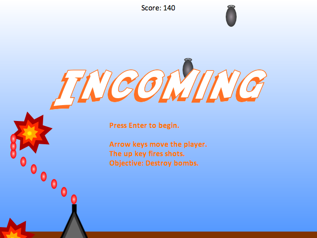

# Incoming <small>- The Game</small>

In this game you try to shoot falling bombs before they crash down to Earth and explode. You get points for destroying bombs but lose points for firing unnecessary shots.

I wrote this game as an experiment to write a non-trivial program in [Elm], a concept language for demonstrating [functional reactive programming].

Take a look at this game's source code if you are interested in reading a moderately complex Elm program.

[Elm]: http://elm-lang.org/
[functional reactive programming]: http://elm-lang.org/learn/What-is-FRP.elm

## Requirements

* Elm 0.10.1

## How to Run

* Clone this repository.
* In the cloned directory, open a terminal window and run the command `elm-server`.
* Open a web browser and go to <http://localhost:8000/Main.elm>

## License

Copyright &copy; 2014 by David Foster

Including the hastily-created graphics.